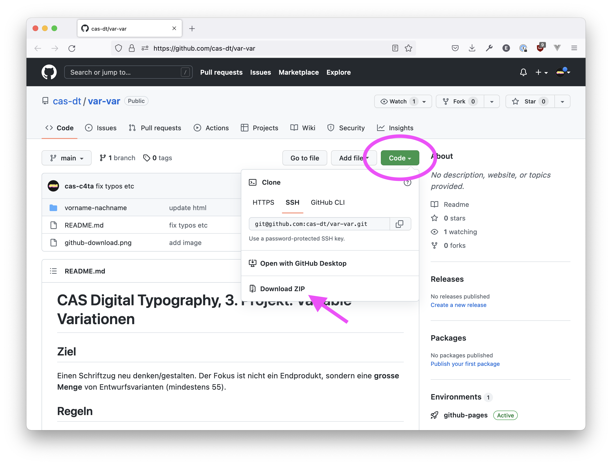

# CAS Digital Typography, 3. Projekt: Variable Variationen

## Ziel

Einen Schriftzug neu denken/gestalten. Der Fokus ist nicht ein Endprodukt, sondern eine **grosse Menge** von Entwurfsvarianten (mindestens 100).

## Regeln

- Du verwendest ausschliesslich Variable Fonts.
- Der Browser ist dein Werkzeug.
  - zum  Entwerfen (hier gibt es Spielraum)
  - für die Dokumentation
  - für die Präsentation
- Jeder Entwurfsschritt wird auf einer separaten Website festgehalten (Code, Screenshot, Foto, Film, GIF)
  - Der Entwurf füllt das Browser-Fenster in sinnvoller Weise aus, z.B. `width: 80vw`
- Es ist erlaubt ...
  - zu dekonstruieren
  - zu multiplizieren
  - Collage
  - Fotografie
  - Kleben
  - Schneiden
  - assoziativ passend Inhalt hinzuzufügen
  - assoziativ passend Inhalt zu ergänzen
  - neu zu denken/interpretieren

## Anforderungen

- Du ergründest das Potential des Variable Fonts in seinem vollen Umfang.
- Du lotest auch Varianten in der Interaktion und Animation aus: hover, Animation, Transition
- Du sammelst alle Experimente in separaten HTML-Dokumenten
- Das Schriftbild unterscheidet sich von einer Entwurfsvariante zur nächsten (nicht zweimal das Gleiche mit anderen Farbeffekten).

## Abgabe

- Als Website:
  - Übersichtsseite mit Links auf Subpages gemäss Vorlage (siehe nächster Abschnitt)
  - jeder Entwurf ist eine Subpage
    - Die Mindestzahl von Subpages ist 100
    - Der Ordner ist wie folgt beschriftet: `vorname-nachname-001` (dreistellige Zahl am Ende)
    - Mindestens die Hälfte der Subpages enthält animierten und/oder interaktiven Inhalt

## Vorlage Herunterladen

Du kannst [den ganzen Projektbeschrieb bei GitHub](https://github.com/cas-dt/var-var) herunterladen. Dazu klickst du den grünen Knopf ‘Code’ an, und dann auf ‘Download ZIP’ (siehe Bild).

- entpacke das ZIP
- du brauchst nur den Ordner `vorname-nachname`
- benennen ihn um (mit deinem eigenen Namen)
- öffne ihn in Visual Studio Code (Neues Fenster, Ordner öffnen)
- Klicke unten rechts auf ‘Go Live’
- etc.

## Ablauf

### Vorbereitung

- Videos schauen (siehe unten)
- Text lesen: [Introduction to variable fonts on the web](https://web.dev/variable-fonts/)
- Auf unserem [Miro Board](https://miro.com/app/board/o9J_ljsXVN4=/) Bildmaterial hunzufügen.

### Erster Tag: 03/04.12.

- Einführung in Variable Fonts
- Beginn Entwurfsphase

### Zweiter Tag: 21/22.01.

- Arbeit an Entwürfen
- Präsentation

Es findet keine eigentliche Präsentation statt, sondern wir machen eine Art Gesamtschau: Jede\*r wählt eine bestimmte Zahl von Entwüfen, die wir am Ende des Tages zusammen anschauen.

## Links

- [Variable Fonts, A simple resource for finding and trying variable fonts](https://v-fonts.com/)
 - [Introduction to variable fonts on the web](https://web.dev/variable-fonts/) (bitte lesen)
 - [MDN, Variable fonts guide](https://developer.mozilla.org/en-US/docs/Web/CSS/CSS_Fonts/Variable_Fonts_Guide) (zum Nachschlagen)
 - [Wakamaifondue](https://wakamaifondue.com/beta/): What can my font do? – Analyse-Tool für Variable Fonts von [Roel Nieskens](https://pixelambacht.nl/)
 - [Liste aller Variable Fonts bei Google, inklusive embed Links](https://pixelambacht.nl/google-variable-fonts-links/), ebenfalls von [Roel Nieskens](https://pixelambacht.nl/)

## Code Beispiele

 - [CSS Animation mit Google-vFont](https://codepen.io/oolong32/pen/PobPmEL), eingebettet in HTML (Pen Settings, HTML, ‘Stuff for `<head>`’)
 - [CSS Animation mit Google-vFont](https://codepen.io/oolong32/pen/zYdJzxN), eingebettet in CSS
 - [CSS Transition mit Google-vFont](https://codepen.io/oolong32/pen/zYovoBo)
 - [Animation eines Google-vFonts, ausgelöst mit JS](https://codepen.io/oolong32/pen/dyOYWdK)

## Videos

- [Ein Variable Font fürs Web](https://youtu.be/CI8QvH_SDBs)
- [Fremd gehostete Fonts](https://youtu.be/bFMyAmIUzWo) (Begriff: *CDN* = Content Delivery Network)
- [Einen Variable Font von Google Fonts einsetzen](https://youtu.be/77T4RtF3O2A)
- [Variable Font Eigenschaften mit CSS steuern](https://youtu.be/xzBWTV2pJl8), [CodePen-Beispiel](https://codepen.io/oolong32/pen/zYovoBo)
- [Variable Font Eigenschaften mit CSS animieren](https://youtu.be/y4oW1T7R1es), [CodePen-Beispiel](https://codepen.io/oolong32/pen/PobPmEL)
- [Variable Font Eigenschaften mit JavaScript steuern](https://youtu.be/SKIJzeRfs_s), [CodePen-Beispiel](https://codepen.io/oolong32/pen/dyOYWdK)
